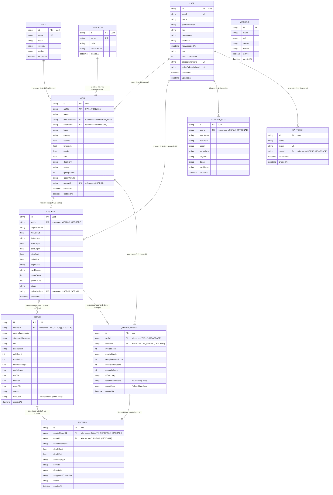

# WellQC+ Database Entity-Relationship Diagram (ERD) & ID Connection Guide

This document details the complete relational architecture of the WellQC+ platform based on the Prisma schema, illustrating all entity relationships, key mappings, cascade rules, and multi-tenant isolation pathways.

---

## 1. Visual Entity-Relationship Diagram (Mermaid)



---

## 2. ID Connection Matrix & Relational Mappings

Every entity in WellQC+ uses **UUID v4 strings** as its primary key (`id`). The table below outlines each relationship, the joining keys, and the deletion cascades:

| Source Entity | Relationship Type | Target Entity | Foreign Key Column | Referenced Key Column | On Delete Cascade | Business Purpose |
|---|---|---|---|---|---|---|
| **`User`** | $1 : N$ | **`Well`** | `Well.ownerId` | `User.id` | `SetNull` | Workspace multi-tenant ownership. Wells belong to specific user workspaces. |
| **`User`** | $1 : N$ | **`LASFile`** | `LASFile.uploadedById` | `User.id` | `SetNull` | Tracks which petrophysicist uploaded the raw dataset. |
| **`User`** | $1 : N$ | **`ActivityLog`** | `ActivityLog.userId` | `User.id` | `SetNull` | Compliance and audit trail attribution. |
| **`User`** | $1 : N$ | **`APIToken`** | `APIToken.userId` | `User.id` | `Cascade` | Deleting a user revokes all their programmatic API tokens. |
| **`Field`** | $1 : N$ | **`Well`** | `Well.fieldName` | `Field.name` | `NoAction` / Default | Categorizes wells by regional geological basin/field. |
| **`Operator`** | $1 : N$ | **`Well`** | `Well.operatorName` | `Operator.name` | `NoAction` / Default | Tracks oilfield operating companies (e.g., Shell, Chevron). |
| **`Well`** | $1 : N$ | **`LASFile`** | `LASFile.wellId` | `Well.id` | `Cascade` | A well can have multiple log runs/files over its lifecycle. |
| **`Well`** | $1 : N$ | **`QualityReport`** | `QualityReport.wellId` | `Well.id` | `Cascade` | Historical QA reports associated with the well. |
| **`LASFile`** | $1 : N$ | **`Curve`** | `Curve.lasFileId` | `LASFile.id` | `Cascade` | Deleting a file cascades down to delete all its extracted curve channels. |
| **`LASFile`** | $1 : N$ | **`QualityReport`** | `QualityReport.lasFileId` | `LASFile.id` | `Cascade` | Each LAS file generation produces a formal QA report. |
| **`QualityReport`** | $1 : N$ | **`Anomaly`** | `Anomaly.qualityReportId` | `QualityReport.id` | `Cascade` | Deleting a report removes all identified anomaly flags. |
| **`Curve`** | $1 : N$ | **`Anomaly`** | `Anomaly.curveId` | `Curve.id` | `SetNull` / Optional | Connects an anomaly to its specific curve channel (e.g., RHOB spike). |

---

## 3. Data Lifecycle & Ingestion Flow

When an engineer uploads a LAS file via the **Upload Workspace** (`POST /api/las?action=commit`), an atomic `db.$transaction()` executes across the relational hierarchy in the following order:

```
                  ┌──────────────┐
                  │     USER     │ (Authenticated Owner)
                  └──────┬───────┘
                         │
                         ▼
                  ┌──────────────┐
                  │     WELL     │ (Upserted via apiNo / UWI)
                  └──────┬───────┘
                         │
                         ▼
                  ┌──────────────┐
                  │   LAS_FILE   │ (Metadata: Start, Stop, Step, Null)
                  └──────┬───────┘
            ┌────────────┴────────────┐
            ▼                         ▼
     ┌──────────────┐          ┌──────────────┐
     │    CURVE     │          │QUALITY_REPORT│ (Overall Score, AI Summary)
     │ (GR, RHOB...)│          └──────┬───────┘
     └──────┬───────┘                 │
            │                         │
            └───────────► ◄───────────┘
                          │
                          ▼
                   ┌──────────────┐
                   │   ANOMALY    │ (Spikes, Flatlines, Limit Violations)
                   └──────────────┘
```

1. **User Verification (`User.id`):** The session token resolves the caller's UUID.
2. **Well Upsert (`Well.id`):** Look up by unique `apiNo`. If it exists, update metadata and quality score; otherwise, create a new record assigned to `User.id`.
3. **LAS File Registration (`LASFile.id`):** Linked to `Well.id` and `User.id`.
4. **Curves Creation (`Curve.id`):** Multiple curve rows created, each tied to `LASFile.id` with a downsampled `dataJson` array for SVG rendering.
5. **Quality Report Commit (`QualityReport.id`):** Linked both to `Well.id` and `LASFile.id`.
6. **Anomalies Batch Insert (`Anomaly.id`):** All identified flags inserted, referencing `QualityReport.id` and optionally `Curve.id`.
7. **Audit Trail Logging (`ActivityLog.id`):** Recorded with `userId` and `targetId = lasFile.id`.

---

## 4. Multi-Tenant Isolation Architecture

* **Tenant Boundary:** The platform enforces strict isolation via `Well.ownerId = User.id`.
* **Deep Cascades:** Because all child entities (`LASFile`, `Curve`, `QualityReport`, `Anomaly`) chain directly back to `Well.id`, querying by `well.ownerId == currentUser.id` guarantees zero data leakage between different operating companies or petrophysical teams.
