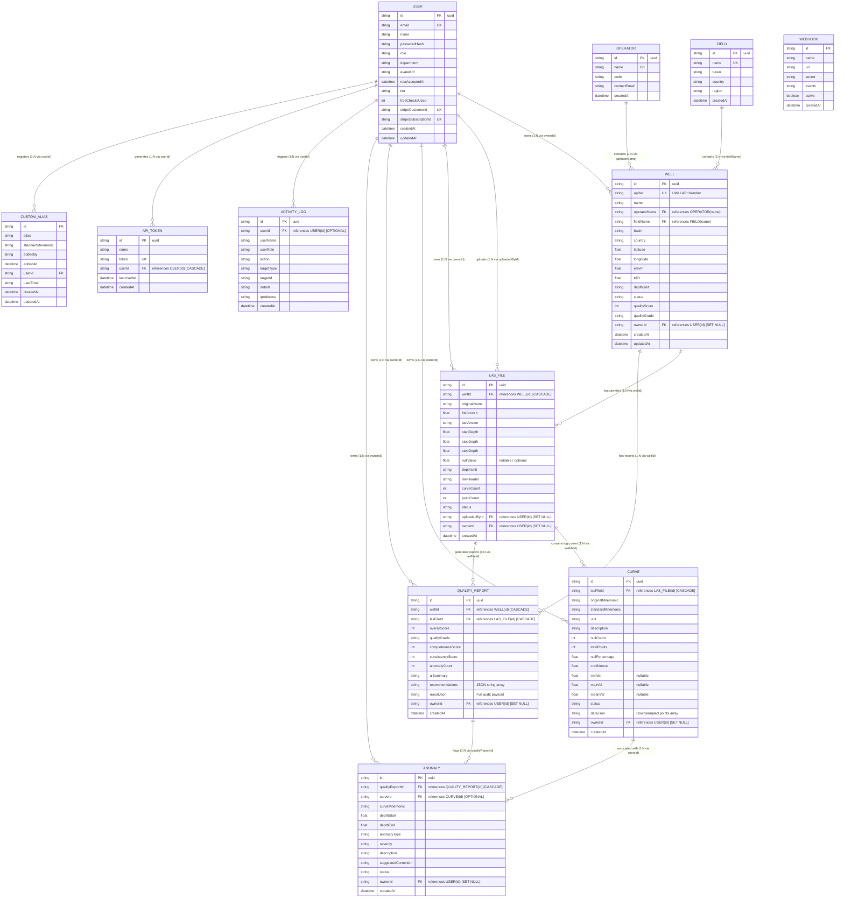

# WellQC+ Database Entity-Relationship Diagram (ERD) & ID Connection Guide

This document details the complete relational architecture of the WellQC+ platform based on the Prisma schema, illustrating all entity relationships, key mappings, cascade rules, and multi-tenant isolation pathways.

---

## 1. Visual Entity-Relationship Diagram (Mermaid)


```mermaid
erDiagram
    USER ||--o{ WELL : "owns (1:N via ownerId)"
    USER ||--o{ LAS_FILE : "uploads (1:N via uploadedById)"
    USER ||--o{ LAS_FILE : "owns (1:N via ownerId)"
    USER ||--o{ CURVE : "owns (1:N via ownerId)"
    USER ||--o{ QUALITY_REPORT : "owns (1:N via ownerId)"
    USER ||--o{ ANOMALY : "owns (1:N via ownerId)"
    USER ||--o{ ACTIVITY_LOG : "triggers (1:N via userId)"
    USER ||--o{ API_TOKEN : "generates (1:N via userId)"
    USER ||--o{ CUSTOM_ALIAS : "registers (1:N via userId)"

    FIELD ||--o{ WELL : "contains (1:N via fieldName)"
    OPERATOR ||--o{ WELL : "operates (1:N via operatorName)"

    WELL ||--o{ LAS_FILE : "has raw files (1:N via wellId)"
    WELL ||--o{ QUALITY_REPORT : "has reports (1:N via wellId)"

    LAS_FILE ||--o{ CURVE : "contains log curves (1:N via lasFileId)"
    LAS_FILE ||--o{ QUALITY_REPORT : "generates reports (1:N via lasFileId)"

    QUALITY_REPORT ||--o{ ANOMALY : "flags (1:N via qualityReportId)"
    CURVE ||--o{ ANOMALY : "associated with (1:N via curveId)"

    CUSTOM_ALIAS {
        string id PK
        string alias
        string standardMnemonic
        string addedBy
        datetime addedAt
        string userId FK
        string userEmail
        datetime createdAt
        datetime updatedAt
    }

    WEBHOOK {
        string id PK
        string name
        string url
        string secret
        string events
        boolean active
        datetime createdAt
    }

    USER {
        string id PK "uuid"
        string email UK
        string name
        string passwordHash
        string role
        string department
        string avatarUrl
        datetime ndaAcceptedAt
        string tier
        int freeChecksUsed
        string stripeCustomerId UK
        string stripeSubscriptionId UK
        datetime createdAt
        datetime updatedAt
    }

    OPERATOR {
        string id PK "uuid"
        string name UK
        string code
        string contactEmail
        datetime createdAt
    }

    FIELD {
        string id PK "uuid"
        string name UK
        string basin
        string country
        string region
        datetime createdAt
    }

    WELL {
        string id PK "uuid"
        string apiNo UK "UWI / API Number"
        string name
        string operatorName FK "references OPERATOR(name)"
        string fieldName FK "references FIELD(name)"
        string basin
        string country
        float latitude
        float longitude
        float elevFt
        float tdFt
        string depthUnit
        string status
        int qualityScore
        string qualityGrade
        string ownerId FK "references USER(id) [SET NULL]"
        datetime createdAt
        datetime updatedAt
    }

    LAS_FILE {
        string id PK "uuid"
        string wellId FK "references WELL(id) [CASCADE]"
        string originalName
        float fileSizeKb
        string lasVersion
        float startDepth
        float stopDepth
        float stepDepth
        float nullValue "nullable / optional"
        string depthUnit
        string rawHeader
        int curveCount
        int pointCount
        string status
        string uploadedById FK "references USER(id) [SET NULL]"
        string ownerId FK "references USER(id) [SET NULL]"
        datetime createdAt
    }

    CURVE {
        string id PK "uuid"
        string lasFileId FK "references LAS_FILE(id) [CASCADE]"
        string originalMnemonic
        string standardMnemonic
        string unit
        string description
        int nullCount
        int totalPoints
        float nullPercentage
        float confidence
        float minVal "nullable"
        float maxVal "nullable"
        float meanVal "nullable"
        string status
        string dataJson "Downsampled points array"
        string ownerId FK "references USER(id) [SET NULL]"
        datetime createdAt
    }

    QUALITY_REPORT {
        string id PK "uuid"
        string wellId FK "references WELL(id) [CASCADE]"
        string lasFileId FK "references LAS_FILE(id) [CASCADE]"
        int overallScore
        string qualityGrade
        int completenessScore
        int consistencyScore
        int anomalyCount
        string aiSummary
        string recommendations "JSON string array"
        string reportJson "Full audit payload"
        string ownerId FK "references USER(id) [SET NULL]"
        datetime createdAt
    }

    ANOMALY {
        string id PK "uuid"
        string qualityReportId FK "references QUALITY_REPORT(id) [CASCADE]"
        string curveId FK "references CURVE(id) [OPTIONAL]"
        string curveMnemonic
        float depthStart
        float depthEnd
        string anomalyType
        string severity
        string description
        string suggestedCorrection
        string status
        string ownerId FK "references USER(id) [SET NULL]"
        datetime createdAt
    }

    ACTIVITY_LOG {
        string id PK "uuid"
        string userId FK "references USER(id) [OPTIONAL]"
        string userName
        string userRole
        string action
        string targetType
        string targetId
        string details
        string ipAddress
        datetime createdAt
    }

    API_TOKEN {
        string id PK "uuid"
        string name
        string token UK
        string userId FK "references USER(id) [CASCADE]"
        datetime lastUsedAt
        datetime createdAt
    }
```

---

## 2. ID Connection Matrix & Relational Mappings

Every entity in WellQC+ uses **UUID v4 strings** as its primary key (`id`). The table below outlines each relationship, the joining keys, and the deletion cascades:

| Source Entity | Relationship Type | Target Entity | Foreign Key Column | Referenced Key Column | On Delete Cascade | Business Purpose |
|---|---|---|---|---|---|---|
| **`User`** | $1 : N$ | **`Well`** | `Well.ownerId` | `User.id` | `SetNull` | Workspace multi-tenant ownership. Wells belong to specific user workspaces. |
| **`User`** | $1 : N$ | **`LASFile`** | `LASFile.uploadedById` | `User.id` | `SetNull` | Tracks which petrophysicist uploaded the raw dataset. |
| **`User`** | $1 : N$ | **`LASFile`** | `LASFile.ownerId` | `User.id` | `SetNull` | Direct tenant ownership for individual LAS files. |
| **`User`** | $1 : N$ | **`Curve`** | `Curve.ownerId` | `User.id` | `SetNull` | Direct tenant ownership for extracted log curves. |
| **`User`** | $1 : N$ | **`QualityReport`** | `QualityReport.ownerId` | `User.id` | `SetNull` | Direct tenant ownership for QA audit records. |
| **`User`** | $1 : N$ | **`Anomaly`** | `Anomaly.ownerId` | `User.id` | `SetNull` | Direct tenant ownership for detected curve anomalies. |
| **`User`** | $1 : N$ | **`ActivityLog`** | `ActivityLog.userId` | `User.id` | `SetNull` | Compliance and audit trail attribution. |
| **`User`** | $1 : N$ | **`APIToken`** | `APIToken.userId` | `User.id` | `Cascade` | Deleting a user revokes all their programmatic API tokens. |
| **`User`** | $1 : N$ | **`CustomAlias`** | `CustomAlias.userId` | `User.id` | `Cascade` | User-scoped petrophysical mnemonic aliases strictly isolated per account. |
| **`Field`** | $1 : N$ | **`Well`** | `Well.fieldName` | `Field.name` | `NoAction` / Default | Categorizes wells by regional geological basin/field. |
| **`Operator`** | $1 : N$ | **`Well`** | `Well.operatorName` | `Operator.name` | `NoAction` / Default | Tracks oilfield operating companies (e.g., Shell, Chevron). |
| **`Well`** | $1 : N$ | **`LASFile`** | `LASFile.wellId` | `Well.id` | `Cascade` | A well can have multiple log runs/files over its lifecycle. |
| **`Well`** | $1 : N$ | **`QualityReport`** | `QualityReport.wellId` | `Well.id` | `Cascade` | Historical QA reports associated with the well. |
| **`LASFile`** | $1 : N$ | **`Curve`** | `Curve.lasFileId` | `LASFile.id` | `Cascade` | Deleting a file cascades down to delete all its extracted curve channels. |
| **`LASFile`** | $1 : N$ | **`QualityReport`** | `QualityReport.lasFileId` | `LASFile.id` | `Cascade` | Each LAS file generation produces a formal QA report. |
| **`QualityReport`** | $1 : N$ | **`Anomaly`** | `Anomaly.qualityReportId` | `QualityReport.id` | `Cascade` | Deleting a report removes all identified anomaly flags. |
| **`Curve`** | $1 : N$ | **`Anomaly`** | `Anomaly.curveId` | `Curve.id` | `SetNull` / Optional | Connects an anomaly to its specific curve channel (e.g., RHOB spike). |

> [!NOTE]
> **Optional / Nullable Fields**: `LASFile.nullValue` is optional (`Float?` in Prisma, `nullable=True` in SQLAlchemy with default `None`), ensuring that files lacking explicit NULL header markers can be ingested without database schema violation. `Curve.minVal`, `Curve.maxVal`, and `Curve.meanVal` are likewise nullable for empty or all-null curve logs.

---

## 3. Data Lifecycle & Ingestion Flow (Python FastAPI & SQLAlchemy)

When an engineer uploads a LAS file via the **Upload Workspace** (`POST /api/las`), the request is routed through the Python FastAPI backend (`backend/app/api/las.py`), executing atomic persistence via **SQLAlchemy 2.0 with connection pooling (`psycopg2-binary`)**:

```
                  ┌──────────────┐
                  │     USER     │ (Authenticated Owner via HMAC-SHA256 session)
                  └──────┬───────┘
                         │
                         ▼
                  ┌──────────────┐
                  │     WELL     │ (Upserted via apiNo / UWI with ownerId isolation)
                  └──────┬───────┘
                         │
                         ▼
                  ┌──────────────┐
                  │   LAS_FILE   │ (Metadata: Start, Stop, Step, optional Null, Raw Header)
                  └──────┬───────┘
            ┌────────────┴────────────┐
            ▼                         ▼
     ┌──────────────┐          ┌──────────────┐
     │    CURVE     │          │QUALITY_REPORT│ (Overall Score, Grade, AI Summary)
     │ (GR, RHOB...)│          └──────┬───────┘
     └──────┬───────┘                 │
            │                         │
            └───────────► ◄───────────┘
                          │
                          ▼
                   ┌──────────────┐
                   │   ANOMALY    │ (Spikes, Flatlines, Limit Violations)
                   └──────────────┘
```

1. **User Verification (`User.id`):** The `wellqc_session` HMAC-SHA256 cookie resolves the caller's UUID.
2. **Well Upsert (`Well.id`):** Look up by unique `apiNo`. If it exists, update metadata and quality score; otherwise, create a new record assigned to `User.id`.
3. **LAS File Registration (`LASFile.id`):** Linked to `Well.id`, `uploadedById`, and `ownerId = User.id`. Supports optional `nullValue`.
4. **Curves Creation (`Curve.id`):** Multiple curve rows created, each tied to `LASFile.id` and `ownerId = User.id` with a downsampled `dataJson` array for SVG rendering and full-fidelity arrays for the multi-track wireline explorer.
5. **Quality Report Commit (`QualityReport.id`):** Linked both to `Well.id`, `LASFile.id`, and `ownerId = User.id`.
6. **Anomalies Batch Insert (`Anomaly.id`):** All identified flags inserted, referencing `QualityReport.id`, `ownerId = User.id`, and optionally `Curve.id`.
7. **Audit Trail Logging (`ActivityLog.id`):** Recorded with `userId` and `targetId = well.id`.

---

## 4. Multi-Tenant Isolation Architecture

* **Hierarchical & Direct Entity Isolation:** The platform enforces defense-in-depth multi-tenant isolation. Wells are partitioned by `Well.ownerId == User.id`, while downstream entities (`LASFile.ownerId`, `Curve.ownerId`, `QualityReport.ownerId`, `Anomaly.ownerId`) also store direct tenant IDs. Queries can either traverse parent well ownership or filter directly by `ownerId`, eliminating data leakage between independent user workspaces and organizations.
* **Custom Alias Privacy:** Custom mnemonic mappings (`CustomAlias`) are strictly isolated to the creating user (`CustomAlias.userId == current_user.id` or `CustomAlias.userEmail == current_user.email`). Unauthenticated users and other tenants cannot view, edit, or delete custom aliases added by other users. A unique compound index (`standardMnemonic`, `alias`, `userId`) prevents duplicate mappings within a user's workspace while allowing different tenants to map the same mnemonic differently.
* **Activity & Audit Trail Isolation:** `ActivityLog` queries are scoped strictly to `ActivityLog.userId == current_user.id`, ensuring audit logs and user actions remain private to each individual account.
* **Role-Based Access Control (RBAC):** Privileged actions (e.g. system administration, global dictionary moderation, webhook configuration) enforce strict permission checks (`role == "ADMIN"`). Non-admin roles (`PETROPHYSICIST`, `DATA_ENGINEER`, `GEOSCIENTIST`, `VIEWER`) are constrained to their respective workspace boundaries.
